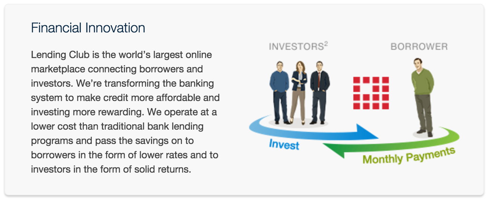

# Predicting default clients of Lending Club Loans
LendingClub is a US peer-to-peer lending company, headquartered in San Francisco, California. It was the first peer-to-peer lender to register its offerings as securities with the Securities and Exchange Commission (SEC), and to offer loan trading on a secondary market. LendingClub is the world's largest peer-to-peer lending platform.

LendingClub enabled borrowers to create unsecured personal loans between $1,000 and $40,000. The standard loan period was three years. Investors were able to search and browse the loan listings on LendingClub website and select loans that they wanted to invest in based on the information supplied about the borrower, amount of loan, loan grade, and loan purpose. Investors made money from the interest on these loans. LendingClub made money by charging borrowers an origination fee and investors a service fee.

Description: In this project, we worked with the public LendingClub data, with a size of 2.5+ GB, containing 2.26 million loans from 2007 to 2018, each of which has 151 associated features. 

Our Goal: Given historical data on loans given out with information on whether or not the borrower defaulted (charge-off), can we build a model that can predict whether or not a borrower will pay back their loan? This way in the future when we get a new potential customer we can assess whether or not they are likely to pay back the loan. 

- Data Source: Kaggle (https://www.kaggle.com/wordsforthewise/lending-club). 

